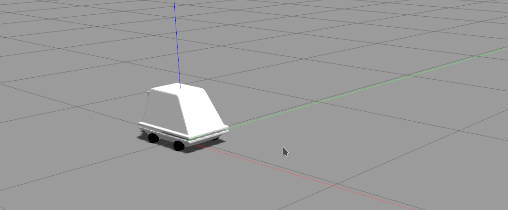

# MSE6
Gazebo model and soft for droid MSE6 (also known as [mouse droid](https://starwars.fandom.com/wiki/MSE-6-series_repair_droid)) from Star Wars



## Installation
On Melodic\Noetic
```shell
cd <your_workspace>/src
git clone https://github.com/MoscowskyAnton/MSE6
git clone https://github.com/CIR-KIT/steer_drive_ros -b melodic-devel
sudo apt install ros-$ROS_DISTRO-ackermann-steering-controller ros-$ROS_DISTRO-costmap-2d ros-$ROS_DISTRO-nav-core ros-$ROS_DISTRO-base-local-planner ros-$ROS_DISTRO-teb-local-planner ros-$ROS_DISTRO-map-server ros-$ROS_DISTRO-move-base ros-$ROS_DISTRO-global-planner ros-$ROS_DISTRO-hector-gazebo-plugins
catkin_make
```

Alternatively, install all the system dependencies using rosdep:
```
cd <your_workspace>
rosdep install --from-paths src --ignore-src -r -y
```

## Launch
One droid in Gazebo
```
roslaunch mse6_config gazebo.launch
```

Two droids in Gazebo
```
roslaunch mse6_config multidroid_gazebo.launch
```
Droid amount can be set by `num_droids` parameter (up to 5).
